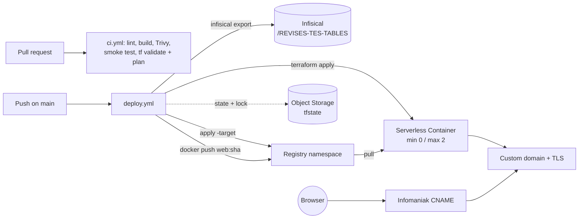

# Scaleway Serverless Deployment Implementation Plan

> **For agentic workers:** REQUIRED SUB-SKILL: Use superpowers:subagent-driven-development (recommended) or superpowers:executing-plans to implement this plan task-by-task. Steps use checkbox (`- [ ]`) syntax for tracking.

**Goal:** Deploy the Next.js static export as a scale-to-zero Scaleway Serverless Container at `revises-tes-tables.gravitek.io`, with Terraform in-repo, GitHub Actions for infra and app deployment, and Infisical as the secrets source of truth.

**Architecture:** A multi-stage Dockerfile builds the static export and serves it with an unprivileged nginx on port 8080. A single Terraform root module in `infra/` declares the registry namespace, container namespace, container and custom domain, with state in a Scaleway Object Storage bucket. Two workflows (`ci.yml` on PRs, `deploy.yml` on `main`) fetch the Scaleway CI key from Infisical with a pinned CLI, build and push the image tagged with the git SHA, and run `terraform apply`.

**Tech Stack:** Next.js 16 static export, nginx (nginxinc/nginx-unprivileged alpine-slim), Docker Buildx, Terraform >= 1.10 with provider `scaleway/scaleway ~> 2.84`, GitHub Actions, Infisical CLI 0.43.138 (Universal Auth), Trivy.

**Spec:** `docs/superpowers/specs/2026-10-04-scaleway-serverless-deployment-design.md`

## Global Constraints

- All source code, comments, commit messages and infra docs in English. The user-facing `README.md` is in French and stays in French.
- Conventional commits, no reference to Claude in commit messages, no `Co-Authored-By` trailer.
- Never push to the remote. Commit on the branch `feat/scaleway-deployment` only.
- Scaleway project `7b8f19b7-3895-43d5-a9e5-0fefa17a0be9`, region `fr-par`.
- Hostname `revises-tes-tables.gravitek.io`. DNS CNAME is created manually at Infomaniak.
- Terraform state: bucket `revises-tes-tables-tfstate`, key `revises-tes-tables/terraform.tfstate`, S3 endpoint `https://s3.fr-par.scw.cloud`, `use_lockfile = true`.
- Infisical: domain `https://eu.infisical.com`, env `prod`, path `/REVISES-TES-TABLES`, Universal Auth via GitHub secrets `INFISICAL_CLIENT_ID` and `INFISICAL_CLIENT_SECRET`. Infisical holds `SCW_ACCESS_KEY` and `SCW_SECRET_KEY` only.
- The Infisical → GitHub integration must never be enabled on this repository.
- Container: port 8080, `min_scale 0`, `max_scale 2`, `cpu_limit 70`, `memory_limit_bytes 128000000`, `sandbox "v2"`, `https_connections_only true`, liveness probe on `/healthz`.
- Image name: `rg.fr-par.scw.cloud/revises-tes-tables/web:<git-sha>` (plus `latest`).
- GitHub Actions pinned to full commit SHAs with a version comment. `permissions: contents: read` at workflow level.
- Node version `22` from `.nvmrc`.
- Secrets never appear in logs: every value exported from Infisical is registered with `::add-mask::`.

## Review Focus

1. Request `/config` without trailing slash (the committed `public/sitemap.xml` links pages this way): must answer `301` with `Location: /config/`, not 404 and not an absolute `http://…:8080` URL. Pinned by `scripts/smoke-test.sh` in Task 2.
2. Unknown path such as `/does-not-exist/`: must answer HTTP `404` with the Next.js `404.html` body, not `200`. Pinned by `scripts/smoke-test.sh` in Task 2.
3. Security and cache headers on every response type: `/_next/static/*` immutable and HTML `no-cache`, and `X-Content-Type-Options: nosniff` present on both (nginx `add_header` in a location silently drops parent headers). Pinned by `scripts/smoke-test.sh` in Task 2.
4. Infisical fetch with a wrong credential or an empty folder: the step must fail with an explicit error, never a green step with no variables. Pinned by the local failure-path test in Task 4.
5. Second `terraform apply` with an unchanged image must be a no-op (Scaleway normalises memory in 10^6 units; probe defaults can drift). Pinned as a mandatory post-deploy check in the runbook (Task 8) and verified during the first deploy.

---

### Task 1: Restore an installable dependency set (prerequisite)

`npm ci` fails on `main` today: Dependabot merged TypeScript 7 while `typescript-eslint` requires `< 6.1.0`, and Tailwind 4 while the config and CSS are written for Tailwind 3. Any CI job running `npm ci` would fail on every PR. Verified resolution: TypeScript `^5.9.3` + Tailwind `^3.4.17` resolve cleanly with Next 16.3.6 and ESLint 10.

**Files:**
- Modify: `package.json` (devDependencies `typescript`, `tailwindcss`)
- Modify: `package-lock.json` (regenerated)
- Modify: `.github/dependabot.yml` (ignore major updates for these two packages)

**Interfaces:**
- Produces: a repo where `npm ci && npm run lint && npm run build` succeeds from a clean `node_modules`. Tasks 2, 5 and 6 depend on it.

- [ ] **Step 1: Reproduce the failure**

Run: `rm -rf node_modules && npm ci --no-audit --no-fund`
Expected: FAIL with `ERESOLVE could not resolve ... peer typescript@">=4.8.4 <6.1.0" from typescript-eslint`.

- [ ] **Step 2: Pin the two packages back to the majors the code is written for**

In `package.json`, change:

```json
    "tailwindcss": "^3.4.17",
    "typescript": "^5.9.3",
```

(leave every other line untouched, keep alphabetical order).

- [ ] **Step 3: Regenerate the lockfile and install**

Run: `npm install --no-audit --no-fund && npm ci --no-audit --no-fund`
Expected: both succeed. `npm ls typescript tailwindcss --depth=0` shows `typescript@5.9.x` and `tailwindcss@3.4.x`.

- [ ] **Step 4: Verify lint and build from the clean install**

Run: `npm run lint && npm run build && ls out/index.html out/404.html out/config/index.html`
Expected: lint passes, build prints the static routes `/ /config /game /results /stats`, the three files exist.

- [ ] **Step 5: Keep Dependabot from re-breaking it**

Replace the content of `.github/dependabot.yml` with:

```yaml
# Dependabot configuration.
# Major updates of TypeScript and Tailwind CSS are ignored on purpose: both need a
# deliberate migration (typescript-eslint peer range, Tailwind v4 config/CSS syntax).
version: 2
updates:
  - package-ecosystem: "npm"
    directory: "/"
    schedule:
      interval: "weekly"
    groups:
      minor-patches:
        patterns:
          - "*"
        update-types:
          - "minor"
          - "patch"
    ignore:
      - dependency-name: "typescript"
        update-types: ["version-update:semver-major"]
      - dependency-name: "tailwindcss"
        update-types: ["version-update:semver-major"]
```

- [ ] **Step 6: Commit**

```bash
git add package.json package-lock.json .github/dependabot.yml
git commit -m "fix(deps): pin typescript 5 and tailwindcss 3 to restore npm ci

Dependabot merged TypeScript 7 (rejected by typescript-eslint's peer range)
and Tailwind 4 (config and CSS still use the v3 syntax), which made npm ci
fail. Ignore major updates of both until a deliberate migration."
```

---

### Task 2: Container image (Dockerfile, nginx, smoke test)

**Files:**
- Create: `.nvmrc`
- Create: `Dockerfile`
- Create: `.dockerignore`
- Create: `docker/nginx.conf`
- Create: `docker/security-headers.conf`
- Create: `scripts/smoke-test.sh`

**Interfaces:**
- Produces: an image exposing port `8080` with `GET /healthz` → `200 ok`, and `scripts/smoke-test.sh <base-url>` (exit 0 on success, 1 with `FAIL: …` on stderr otherwise). Used by `ci.yml` (Task 5) and `deploy.yml` (Task 6).

- [ ] **Step 1: Write the smoke test (the failing test for this task)**

Create `scripts/smoke-test.sh`:

```bash
#!/usr/bin/env bash
# Smoke-test a running instance of the static site.
#
# Usage: scripts/smoke-test.sh <base-url>
#   e.g. scripts/smoke-test.sh http://localhost:8080
#        scripts/smoke-test.sh https://revises-tes-tables.gravitek.io
#
# Checks the behaviours a visitor depends on: health endpoint, pages with and
# without trailing slash (the sitemap links without it), 404 handling, cache
# and security headers. Exit code 0 on success, 1 on the first failure.
set -euo pipefail

BASE="${1:?usage: $0 <base-url>}"
BASE="${BASE%/}"

HEADERS="$(mktemp)"
trap 'rm -f "$HEADERS"' EXIT

fail() { echo "FAIL: $*" >&2; exit 1; }
ok()   { echo "ok    $*"; }

# Perform a GET, store status in STATUS and response headers in $HEADERS.
req() {
  STATUS="$(curl -sS -o /dev/null -D "$HEADERS" -w '%{http_code}' "$BASE$1")"
}

# Print the value of a response header (case-insensitive), empty if absent.
header() {
  grep -i "^$1:" "$HEADERS" | tr -d '\r' | cut -d' ' -f2- || true
}

# Wait for the server: container start locally, cold start on Scaleway.
curl -fsS --retry 12 --retry-delay 5 --retry-all-errors -o /dev/null "$BASE/healthz" \
  || fail "/healthz not reachable at $BASE"
ok "/healthz reachable"

req /healthz
[ "$STATUS" = "200" ] || fail "/healthz returned $STATUS"
ok "/healthz 200"

req /
[ "$STATUS" = "200" ] || fail "/ returned $STATUS"
[[ "$(header cache-control)" == *no-cache* ]] || fail "/ cache-control is '$(header cache-control)', expected no-cache"
[[ "$(header x-content-type-options)" == *nosniff* ]] || fail "/ is missing X-Content-Type-Options: nosniff"
[[ "$(header server)" != *[0-9]* ]] || fail "Server header leaks a version: '$(header server)'"
ok "/ 200 with no-cache and security headers"

req /config/
[ "$STATUS" = "200" ] || fail "/config/ returned $STATUS"
ok "/config/ 200"

req /config
[ "$STATUS" = "301" ] || fail "/config returned $STATUS, expected 301"
[ "$(header location)" = "/config/" ] || fail "/config Location is '$(header location)', expected /config/"
ok "/config 301 -> /config/"

req /does-not-exist/
[ "$STATUS" = "404" ] || fail "unknown path returned $STATUS, expected 404"
curl -sS "$BASE/does-not-exist/" | grep -q "404" || fail "404 response does not contain the 404 page"
ok "unknown path 404 with 404 page"

req /robots.txt
[ "$STATUS" = "200" ] || fail "/robots.txt returned $STATUS"
ok "/robots.txt 200"

ASSET="$(curl -sS "$BASE/" | grep -o '/_next/static/[^"]*\.js' | head -1)"
[ -n "$ASSET" ] || fail "index.html references no /_next/static/*.js asset"
req "$ASSET"
[ "$STATUS" = "200" ] || fail "$ASSET returned $STATUS"
[[ "$(header cache-control)" == *immutable* ]] || fail "$ASSET cache-control is '$(header cache-control)', expected immutable"
[[ "$(header x-content-type-options)" == *nosniff* ]] || fail "$ASSET is missing X-Content-Type-Options: nosniff"
ok "static asset immutable with security headers"

echo "All smoke tests passed against $BASE"
```

Run: `chmod +x scripts/smoke-test.sh && bash -n scripts/smoke-test.sh`
Expected: no output (syntax OK).

- [ ] **Step 2: Run the smoke test to see it fail (nothing is listening)**

Run: `scripts/smoke-test.sh http://localhost:8080`
Expected: after the retries, `FAIL: /healthz not reachable at http://localhost:8080`, exit code 1.

- [ ] **Step 3: Pin the Node version**

Create `.nvmrc`:

```
22
```

- [ ] **Step 4: Write the nginx configuration**

Create `docker/security-headers.conf`:

```nginx
# Security headers shared by every location block.
# nginx's add_header is not inherited when a location defines its own
# add_header (e.g. Cache-Control), so each location includes this file.
add_header X-Content-Type-Options "nosniff" always;
add_header X-Frame-Options "DENY" always;
add_header Referrer-Policy "strict-origin-when-cross-origin" always;
add_header Permissions-Policy "camera=(), microphone=(), geolocation=()" always;
```

Create `docker/nginx.conf`:

```nginx
# nginx configuration serving the Next.js static export (out/) on a Scaleway
# Serverless Container. Base image: nginxinc/nginx-unprivileged (uid 101,
# writable paths under /tmp only, listens on 8080).

# Scaleway sandbox v2 has no copy-on-write for forked processes: one worker keeps
# memory flat within the 128 MB tier.
worker_processes 1;
pid /tmp/nginx.pid;
error_log /dev/stderr warn;

events {
    worker_connections 1024;
}

http {
    include /etc/nginx/mime.types;
    default_type application/octet-stream;

    # Temp paths writable by the unprivileged user.
    client_body_temp_path /tmp/client_temp;
    proxy_temp_path /tmp/proxy_temp;
    fastcgi_temp_path /tmp/fastcgi_temp;
    uwsgi_temp_path /tmp/uwsgi_temp;
    scgi_temp_path /tmp/scgi_temp;

    access_log /dev/stdout;
    sendfile on;
    tcp_nopush on;
    keepalive_timeout 65;

    # Do not disclose the nginx version.
    server_tokens off;

    # Relative Location headers: TLS is terminated by Scaleway, an absolute
    # redirect would otherwise point to http://host:8080/.
    absolute_redirect off;

    gzip on;
    gzip_vary on;
    gzip_min_length 1024;
    gzip_types text/plain text/css application/javascript application/json
               image/svg+xml text/xml application/xml;

    server {
        listen 8080;
        server_name _;
        root /usr/share/nginx/html;
        index index.html;

        # Unknown paths serve the Next.js 404 page with a real 404 status.
        error_page 404 /404.html;

        # Liveness probe target, kept out of the access log.
        location = /healthz {
            access_log off;
            default_type text/plain;
            return 200 "ok\n";
        }

        # Hashed build assets: cache forever.
        location ^~ /_next/static/ {
            include /etc/nginx/snippets/security-headers.conf;
            add_header Cache-Control "public, max-age=31536000, immutable" always;
            try_files $uri =404;
        }

        # Pages (trailingSlash: true -> /config/ serves /config/index.html;
        # /config gets a 301 to /config/ from the index module) and other files.
        location / {
            include /etc/nginx/snippets/security-headers.conf;
            add_header Cache-Control "no-cache" always;
            try_files $uri $uri/ =404;
        }
    }
}
```

- [ ] **Step 5: Write the Dockerfile and .dockerignore**

Create `Dockerfile`:

```dockerfile
# syntax=docker/dockerfile:1
# Multi-stage build: Next.js static export, served by an unprivileged nginx.
# Base images are pinned by digest; Dependabot (docker ecosystem) bumps them.

# ---- Stage 1: build the static export (out/) ------------------------------
FROM node:22-alpine@sha256:0a7108bf6c7bf5de370ffb1a3ed6be93d405b43ff159f681a8d18c0e2bc2e402 AS builder
WORKDIR /app

ENV NEXT_TELEMETRY_DISABLED=1

COPY package.json package-lock.json ./
# --ignore-scripts: no post-install hook is needed and none should run in CI.
RUN npm ci --ignore-scripts --no-audit --no-fund

COPY . .
RUN npm run build

# ---- Stage 2: serve with nginx (non-root, port 8080) ----------------------
FROM nginxinc/nginx-unprivileged:alpine-slim@sha256:c81a27f28bc2d9c2da8998444e653c7b85b9bbbaa92e44ef18d8920784e06507

COPY docker/nginx.conf /etc/nginx/nginx.conf
COPY docker/security-headers.conf /etc/nginx/snippets/security-headers.conf
COPY --from=builder /app/out /usr/share/nginx/html

EXPOSE 8080
# The base image already runs as uid 101 and starts nginx in the foreground.
```

Create `.dockerignore`:

```
node_modules
.next
out
.git
.github
.claude
.specify
docs
infra
scripts
*.md
.env
.env.*
.DS_Store
```

- [ ] **Step 6: Build the image and run the smoke test**

Run:

```bash
docker build -t revises-tes-tables:local . \
  && docker run -d --rm --name rtt-smoke -p 8080:8080 revises-tes-tables:local \
  && scripts/smoke-test.sh http://localhost:8080; rc=$?; docker stop rtt-smoke >/dev/null; \
  [ "$rc" -eq 0 ] && echo "SMOKE OK" || echo "SMOKE FAILED ($rc)"
```

Expected: build succeeds, every `ok` line prints, then `All smoke tests passed against http://localhost:8080` and `SMOKE OK`.

- [ ] **Step 7: Check the container runs as non-root and has one worker**

Run: `docker run --rm revises-tes-tables:local sh -c 'id -u; nginx -T 2>/dev/null | grep -c "worker_processes 1"'`
Expected: `101` then `1`.

- [ ] **Step 8: Commit**

```bash
git add .nvmrc Dockerfile .dockerignore docker/ scripts/smoke-test.sh
git commit -m "feat(docker): serve the static export with unprivileged nginx

Multi-stage image: Node 22 builds the Next.js export, nginx-unprivileged
serves it on 8080 with trailing-slash routing, 404 page, immutable cache
for _next/static, security headers and a /healthz probe. Adds a smoke test
script reused by CI and the deploy pipeline."
```

---

### Task 3: Terraform module (`infra/`)

**Files:**
- Create: `infra/versions.tf`
- Create: `infra/providers.tf`
- Create: `infra/variables.tf`
- Create: `infra/registry.tf`
- Create: `infra/container.tf`
- Create: `infra/domain.tf`
- Create: `infra/outputs.tf`
- Create: `infra/.terraform.lock.hcl` (generated)
- Modify: `.gitignore`

**Interfaces:**
- Consumes: image `rg.fr-par.scw.cloud/revises-tes-tables/web:<image_tag>` pushed by Task 6.
- Produces: variables `image_tag` (string, required) and `enable_custom_domain` (bool, default `true`); outputs `registry_endpoint`, `container_endpoint` (hostname only, CNAME target), `container_url` (`https://…` native URL), `public_url`; resource address `scaleway_registry_namespace.main` used by `deploy.yml` for the targeted apply.

- [ ] **Step 1: Write the failing validation command**

Run: `mkdir -p infra && cd infra && terraform init -backend=false && terraform validate`
Expected: FAIL (`terraform init` on an empty directory: "Terraform initialized in an empty directory!" then `validate` reports no configuration). This is the check the task must turn green.

- [ ] **Step 2: Write versions.tf**

Create `infra/versions.tf`:

```hcl
# Terraform settings: version floor, provider, and remote state backend.
#
# State lives in a private Scaleway Object Storage bucket (S3-compatible) created
# once during the manual bootstrap (see README.md). It is not managed here
# (chicken-and-egg). Locking uses Terraform's native S3 lockfile, which Scaleway
# supports through conditional writes.
#
# Backend credentials come from AWS_ACCESS_KEY_ID / AWS_SECRET_ACCESS_KEY (set to
# the Scaleway API key by the pipeline). Provider credentials come from
# SCW_ACCESS_KEY / SCW_SECRET_KEY.
terraform {
  required_version = ">= 1.10"

  required_providers {
    scaleway = {
      source  = "scaleway/scaleway"
      version = "~> 2.84"
    }
  }

  backend "s3" {
    bucket = "revises-tes-tables-tfstate"
    key    = "revises-tes-tables/terraform.tfstate"
    region = "fr-par"

    endpoints = {
      s3 = "https://s3.fr-par.scw.cloud"
    }

    use_lockfile = true

    # Scaleway Object Storage is S3-compatible but not AWS: skip AWS-only checks.
    skip_credentials_validation = true
    skip_region_validation      = true
    skip_requesting_account_id  = true
    skip_metadata_api_check     = true
    skip_s3_checksum            = true
  }
}
```

- [ ] **Step 3: Write providers.tf and variables.tf**

Create `infra/providers.tf`:

```hcl
# Scaleway provider. Credentials are read from the environment
# (SCW_ACCESS_KEY, SCW_SECRET_KEY) and never stored in code or state inputs.
provider "scaleway" {
  project_id = var.project_id
  region     = var.region
}
```

Create `infra/variables.tf`:

```hcl
variable "project_id" {
  description = "Scaleway project dedicated to this application."
  type        = string
  default     = "7b8f19b7-3895-43d5-a9e5-0fefa17a0be9"
}

variable "region" {
  description = "Scaleway region for all regional resources."
  type        = string
  default     = "fr-par"
}

variable "app_name" {
  description = "Base name for the registry namespace, container namespace and container."
  type        = string
  default     = "revises-tes-tables"
}

variable "hostname" {
  description = "Custom domain served by the container (CNAME to the container endpoint, managed at Infomaniak)."
  type        = string
  default     = "revises-tes-tables.gravitek.io"
}

variable "image_tag" {
  description = "Immutable image tag to deploy (the git commit SHA). Set by the pipeline."
  type        = string

  validation {
    condition     = can(regex("^[A-Za-z0-9_.-]+$", var.image_tag))
    error_message = "image_tag must be a valid Docker tag (letters, digits, '_', '.', '-')."
  }
}

variable "enable_custom_domain" {
  description = "Bind the custom hostname to the container. Set to false on the very first deploy: the CNAME cannot exist before the container endpoint is known."
  type        = bool
  default     = true
}

variable "min_scale" {
  description = "Minimum number of instances. 0 = scale to zero (idle cost near zero, ~1s cold start)."
  type        = number
  default     = 0
}

variable "max_scale" {
  description = "Maximum number of instances under load."
  type        = number
  default     = 2
}
```

- [ ] **Step 4: Write registry.tf, container.tf, domain.tf, outputs.tf**

Create `infra/registry.tf`:

```hcl
# Private Container Registry namespace holding the application images.
# Images are pushed by the deploy pipeline as web:<git-sha> and web:latest.
# The endpoint is deterministic: rg.<region>.scw.cloud/<name>.
resource "scaleway_registry_namespace" "main" {
  name        = var.app_name
  region      = var.region
  project_id  = var.project_id
  is_public   = false
  description = "Container images for revises-tes-tables"
}
```

Create `infra/container.tf`:

```hcl
# Serverless Container running the nginx image that serves the static export.
resource "scaleway_container_namespace" "main" {
  name        = var.app_name
  region      = var.region
  project_id  = var.project_id
  description = "revises-tes-tables Serverless Containers namespace"
}

resource "scaleway_container" "app" {
  name         = "${var.app_name}-web"
  namespace_id = scaleway_container_namespace.main.id
  region       = var.region
  description  = "Static site: Next.js export served by nginx"

  # Immutable tag per deploy: changing image_tag triggers a redeploy, and a
  # rollback is just a previous tag.
  image = "${scaleway_registry_namespace.main.endpoint}/web:${var.image_tag}"

  port     = 8080
  protocol = "http1"
  privacy  = "public"

  min_scale = var.min_scale
  max_scale = var.max_scale

  # Smallest tier (128 MB / 70 mvCPU). Scaleway stores memory in 10^6 units:
  # the decimal value avoids a spurious diff on every plan.
  cpu_limit          = 70
  memory_limit_bytes = 128000000

  # Sandbox v2: faster cold starts (gVisor). nginx needs no exotic syscall.
  sandbox = "v2"

  # Redirect plain HTTP to HTTPS at the edge.
  https_connections_only = true

  liveness_probe {
    http {
      path = "/healthz"
    }
    failure_threshold = 3
    interval          = "10s"
    timeout           = "5s"
  }
}
```

Create `infra/domain.tf`:

```hcl
# Custom domain with Scaleway-managed TLS.
#
# PREREQUISITE: the CNAME `revises-tes-tables.gravitek.io -> <container_endpoint>`
# must resolve at Infomaniak before this resource is applied, otherwise the
# binding fails. On the first deploy the pipeline is run with
# enable_custom_domain=false, the CNAME is created by hand, then a normal run
# binds the domain. See README.md.
resource "scaleway_container_domain" "app" {
  count = var.enable_custom_domain ? 1 : 0

  container_id = scaleway_container.app.id
  hostname     = var.hostname
  region       = var.region
}
```

Create `infra/outputs.tf`:

```hcl
output "registry_endpoint" {
  description = "Container Registry endpoint (image prefix)."
  value       = scaleway_registry_namespace.main.endpoint
}

output "container_endpoint" {
  description = "Native container hostname: the target of the CNAME at Infomaniak."
  value       = trimprefix(scaleway_container.app.public_endpoint, "https://")
}

output "container_url" {
  description = "Native HTTPS URL of the container (always reachable, used by the smoke test)."
  value       = scaleway_container.app.public_endpoint
}

output "public_url" {
  description = "URL visitors use: the custom domain when bound, the native URL otherwise."
  value       = var.enable_custom_domain ? "https://${var.hostname}" : scaleway_container.app.public_endpoint
}
```

- [ ] **Step 5: Ignore Terraform local artefacts**

Append to `.gitignore`:

```
# Terraform local artefacts (state is remote, lock file IS committed)
infra/.terraform/
infra/*.tfstate
infra/*.tfstate.*
infra/*.tfplan
infra/*.tfvars
infra/.terraform.tfstate.lock.info
```

- [ ] **Step 6: Format, init, validate, and generate the provider lock for CI and local platforms**

Run:

```bash
cd infra && terraform fmt -recursive -check && terraform init -backend=false \
  && terraform validate \
  && terraform providers lock -platform=linux_amd64 -platform=darwin_arm64 -platform=darwin_amd64 \
  && cd ..
```

Expected: `Success! The configuration is valid.`, and `infra/.terraform.lock.hcl` exists with `h1:` and `zh:` hashes for the three platforms. If `fmt -check` fails, run `terraform fmt -recursive` and re-run.

- [ ] **Step 7: Commit**

```bash
git add infra/ .gitignore
git commit -m "feat(infra): add Terraform for Scaleway serverless container

Registry namespace, container namespace, scale-to-zero container (128 MB,
sandbox v2, /healthz probe) and optional custom domain binding. State in a
Scaleway Object Storage bucket with native lockfile."
```

---

### Task 4: Infisical secrets composite action

**Files:**
- Create: `.github/actions/infisical-secrets/action.yml`
- Create: `.github/actions/infisical-secrets/fetch.sh`

**Interfaces:**
- Consumes: GitHub secrets `INFISICAL_CLIENT_ID`, `INFISICAL_CLIENT_SECRET` passed as inputs.
- Produces: every key of the Infisical folder as a job environment variable (via `GITHUB_ENV`), masked in logs; fails if any key listed in input `required-keys` is absent. Used by Tasks 5 and 6 with `required-keys: "SCW_ACCESS_KEY SCW_SECRET_KEY"`.

- [ ] **Step 1: Write the fetch script**

Create `.github/actions/infisical-secrets/fetch.sh`:

```bash
#!/usr/bin/env bash
# Fetch an Infisical folder into GITHUB_ENV with log masking.
#
# Inputs (environment):
#   INFISICAL_UNIVERSAL_AUTH_CLIENT_ID, INFISICAL_UNIVERSAL_AUTH_CLIENT_SECRET
#       machine identity credential (read by `infisical login` itself, so the
#       values never appear on a command line)
#   INFISICAL_DOMAIN   e.g. https://eu.infisical.com
#   INFISICAL_ENV      e.g. prod
#   INFISICAL_PATH     e.g. /REVISES-TES-TABLES
#   REQUIRED_KEYS      space-separated keys that must be present
#   GITHUB_ENV         file the variables are appended to
#
# Fails loudly on any error, including an empty export: a broken credential
# must never produce a green step with no variables (the first symptom would be
# a misleading `docker login` failure several steps later).
set -euo pipefail

: "${INFISICAL_UNIVERSAL_AUTH_CLIENT_ID:?INFISICAL_UNIVERSAL_AUTH_CLIENT_ID is required}"
: "${INFISICAL_UNIVERSAL_AUTH_CLIENT_SECRET:?INFISICAL_UNIVERSAL_AUTH_CLIENT_SECRET is required}"
: "${INFISICAL_DOMAIN:?INFISICAL_DOMAIN is required}"
: "${INFISICAL_ENV:?INFISICAL_ENV is required}"
: "${INFISICAL_PATH:?INFISICAL_PATH is required}"
: "${REQUIRED_KEYS:?REQUIRED_KEYS is required}"
: "${GITHUB_ENV:?GITHUB_ENV must point to a writable file}"

echo "Authenticating to Infisical (${INFISICAL_DOMAIN}) with Universal Auth..."
if ! INFISICAL_TOKEN="$(infisical login --method=universal-auth --domain="${INFISICAL_DOMAIN}" --silent --plain)"; then
  echo "::error title=Infisical login failed::Check INFISICAL_CLIENT_ID / INFISICAL_CLIENT_SECRET and the machine identity's access to ${INFISICAL_PATH}."
  exit 1
fi
if [ -z "${INFISICAL_TOKEN}" ]; then
  echo "::error title=Infisical login failed::Login returned an empty token."
  exit 1
fi
export INFISICAL_TOKEN
echo "::add-mask::${INFISICAL_TOKEN}"

export_file="$(mktemp)"
trap 'rm -f "${export_file}"' EXIT

if ! infisical export --domain="${INFISICAL_DOMAIN}" --env="${INFISICAL_ENV}" --path="${INFISICAL_PATH}" --format=dotenv > "${export_file}"; then
  echo "::error title=Infisical export failed::env=${INFISICAL_ENV} path=${INFISICAL_PATH}"
  exit 1
fi
if [ ! -s "${export_file}" ]; then
  echo "::error title=Infisical export is empty::No secret found in env=${INFISICAL_ENV} path=${INFISICAL_PATH}."
  exit 1
fi

count=0
while IFS= read -r line || [ -n "${line}" ]; do
  [ -z "${line}" ] && continue
  key="${line%%=*}"
  value="${line#*=}"
  # The dotenv format wraps values in single quotes: strip them.
  value="${value#\'}"
  value="${value%\'}"
  # Mask real secrets only; short flags like "true" or "fr-par" would otherwise
  # redact ordinary log output.
  if [ "${#value}" -ge 8 ]; then
    echo "::add-mask::${value}"
  fi
  printf '%s=%s\n' "${key}" "${value}" >> "${GITHUB_ENV}"
  count=$((count + 1))
done < "${export_file}"
echo "Exported ${count} secret(s) from ${INFISICAL_PATH} (${INFISICAL_ENV})."

missing=()
for key in ${REQUIRED_KEYS}; do
  if ! grep -q "^${key}=" "${GITHUB_ENV}"; then
    missing+=("${key}")
  fi
done
if [ "${#missing[@]}" -gt 0 ]; then
  echo "::error title=Missing secrets::${missing[*]} not found in Infisical ${INFISICAL_PATH} (${INFISICAL_ENV})."
  exit 1
fi
echo "All required keys present: ${REQUIRED_KEYS}"
```

Run: `chmod +x .github/actions/infisical-secrets/fetch.sh && bash -n .github/actions/infisical-secrets/fetch.sh`
Expected: no output.

- [ ] **Step 2: Test the failure path locally (wrong credential must fail loudly)**

The local machine has the Infisical CLI installed. Run:

```bash
GITHUB_ENV="$(mktemp)" INFISICAL_UNIVERSAL_AUTH_CLIENT_ID=bogus INFISICAL_UNIVERSAL_AUTH_CLIENT_SECRET=bogus \
INFISICAL_DOMAIN=https://eu.infisical.com INFISICAL_ENV=prod INFISICAL_PATH=/REVISES-TES-TABLES \
REQUIRED_KEYS="SCW_ACCESS_KEY SCW_SECRET_KEY" .github/actions/infisical-secrets/fetch.sh; echo "exit=$?"
```

Expected: a line starting with `::error title=Infisical login failed::` and `exit=1`.

- [ ] **Step 3: Test the "missing required key" path with a fake export**

Run (this bypasses the network by stubbing the `infisical` command):

```bash
tmpbin="$(mktemp -d)"; cat > "$tmpbin/infisical" <<'EOF'
#!/usr/bin/env bash
case "$1" in
  login)  echo "fake-token-1234567890" ;;
  export) printf "SCW_ACCESS_KEY='SCWXXXXXXXXXXXXXXXXX'\nOTHER='short'\n" ;;
esac
EOF
chmod +x "$tmpbin/infisical"
env_file="$(mktemp)"
PATH="$tmpbin:$PATH" GITHUB_ENV="$env_file" INFISICAL_UNIVERSAL_AUTH_CLIENT_ID=x INFISICAL_UNIVERSAL_AUTH_CLIENT_SECRET=x \
INFISICAL_DOMAIN=https://eu.infisical.com INFISICAL_ENV=prod INFISICAL_PATH=/REVISES-TES-TABLES \
REQUIRED_KEYS="SCW_ACCESS_KEY SCW_SECRET_KEY" .github/actions/infisical-secrets/fetch.sh; echo "exit=$?"; cat "$env_file"
```

Expected output contains `::add-mask::fake-token-1234567890`, `::add-mask::SCWXXXXXXXXXXXXXXXXX`, no mask line for `short`, `Exported 2 secret(s)`, `::error title=Missing secrets::SCW_SECRET_KEY not found`, `exit=1`, and the env file holds `SCW_ACCESS_KEY=SCWXXXXXXXXXXXXXXXXX` and `OTHER=short` (quotes stripped).

- [ ] **Step 4: Write the composite action**

Create `.github/actions/infisical-secrets/action.yml`:

```yaml
name: Fetch secrets from Infisical
description: >
  Installs a pinned, checksum-verified Infisical CLI, authenticates with a
  machine identity (Universal Auth) and exports one folder into GITHUB_ENV with
  log masking. Fails if a required key is missing.

inputs:
  client-id:
    description: Machine identity client ID (Universal Auth).
    required: true
  client-secret:
    description: Machine identity client secret (Universal Auth).
    required: true
  required-keys:
    description: Space-separated list of keys that must be present in the folder.
    required: true
  path:
    description: Infisical folder to export.
    required: false
    default: /REVISES-TES-TABLES
  environment:
    description: Infisical environment slug.
    required: false
    default: prod
  domain:
    description: Infisical instance URL.
    required: false
    default: https://eu.infisical.com

runs:
  using: composite
  steps:
    - name: Install Infisical CLI (pinned release, checksum verified)
      shell: bash
      env:
        INFISICAL_CLI_VERSION: "0.43.138"
        # sha256 of cli_<version>_linux_amd64.tar.gz from the release's checksums.txt
        INFISICAL_CLI_SHA256: "45a98380964650e4cc2b57ff5361d174afb55b3daf7c2465640d3a7bb7550f92"
      run: |
        set -euo pipefail
        archive="cli_${INFISICAL_CLI_VERSION}_linux_amd64.tar.gz"
        curl -fsSL -o "/tmp/${archive}" \
          "https://github.com/Infisical/cli/releases/download/v${INFISICAL_CLI_VERSION}/${archive}"
        echo "${INFISICAL_CLI_SHA256}  /tmp/${archive}" | sha256sum -c -
        tar -xzf "/tmp/${archive}" -C /tmp infisical
        sudo install -m 0755 /tmp/infisical /usr/local/bin/infisical
        infisical --version

    - name: Export secrets to the job environment
      shell: bash
      env:
        INFISICAL_UNIVERSAL_AUTH_CLIENT_ID: ${{ inputs.client-id }}
        INFISICAL_UNIVERSAL_AUTH_CLIENT_SECRET: ${{ inputs.client-secret }}
        INFISICAL_DOMAIN: ${{ inputs.domain }}
        INFISICAL_ENV: ${{ inputs.environment }}
        INFISICAL_PATH: ${{ inputs.path }}
        REQUIRED_KEYS: ${{ inputs.required-keys }}
      run: "${{ github.action_path }}/fetch.sh"
```

- [ ] **Step 5: Validate the YAML and re-verify the pinned checksum**

Run:

```bash
python3 -c "import yaml,sys; yaml.safe_load(open('.github/actions/infisical-secrets/action.yml')); print('yaml ok')" \
&& curl -fsSL https://github.com/Infisical/cli/releases/download/v0.43.138/checksums.txt | grep 'cli_0.43.138_linux_amd64.tar.gz'
```

Expected: `yaml ok` then `45a98380964650e4cc2b57ff5361d174afb55b3daf7c2465640d3a7bb7550f92  cli_0.43.138_linux_amd64.tar.gz`. (If `yaml` is not installed: `pip3 install --user pyyaml` or skip the YAML line; the workflow run in Task 7 is the real check.)

- [ ] **Step 6: Commit**

```bash
git add .github/actions/infisical-secrets/
git commit -m "ci: add composite action fetching secrets from Infisical

Pinned, checksum-verified CLI; Universal Auth machine identity; dotenv
export masked and written to GITHUB_ENV; explicit failure on login, empty
export or missing required keys."
```

---

### Task 5: Pull request workflow (`ci.yml`)

**Files:**
- Create: `.github/workflows/ci.yml`

**Interfaces:**
- Consumes: `scripts/smoke-test.sh` (Task 2), `infra/` (Task 3), `./.github/actions/infisical-secrets` (Task 4).
- Produces: three required checks on PRs: `Lint and build`, `Docker build, scan and smoke test`, `Terraform validate and plan`.

- [ ] **Step 1: Write the workflow**

Create `.github/workflows/ci.yml`:

```yaml
# Pull request gate. Never pushes an image or touches Scaleway: those are
# merge-only side effects handled by deploy.yml.
#
# The Terraform plan needs the Scaleway CI key from Infisical. Dependabot and
# fork PRs cannot read repository secrets, so the plan is skipped for them and
# the summary says so; lint, build, image scan, fmt and validate still run.
name: CI

on:
  pull_request:
    branches: [main]

permissions:
  contents: read

concurrency:
  group: ci-${{ github.ref }}
  cancel-in-progress: true

env:
  LOCAL_IMAGE_TAG: revises-tes-tables:ci-${{ github.sha }}

jobs:
  app:
    name: Lint and build
    runs-on: ubuntu-latest
    timeout-minutes: 10
    steps:
      - name: Checkout
        uses: actions/checkout@3d3c42e5aac5ba805825da76410c181273ba90b1 # v7.0.1

      - name: Set up Node.js
        uses: actions/setup-node@820762786026740c76f36085b0efc47a31fe5020 # v7.0.0
        with:
          node-version-file: .nvmrc
          cache: npm

      - name: Install dependencies
        run: npm ci --no-audit --no-fund

      - name: Lint
        run: npm run lint

      - name: Build static export
        run: npm run build

  image:
    name: Docker build, scan and smoke test
    runs-on: ubuntu-latest
    timeout-minutes: 15
    steps:
      - name: Checkout
        uses: actions/checkout@3d3c42e5aac5ba805825da76410c181273ba90b1 # v7.0.1

      - name: Set up Docker Buildx
        uses: docker/setup-buildx-action@f87e5991a6d7451dcb8d9637bfbc97413f497069 # v4.4.1

      - name: Build image (local only)
        uses: docker/build-push-action@c3c9e263c25d99ce0380d002d59b67737d91b0dc # v7.4.0
        with:
          context: .
          load: true
          push: false
          tags: ${{ env.LOCAL_IMAGE_TAG }}
          cache-from: type=gha
          cache-to: type=gha,mode=max

      # Merge gate: a fixed HIGH/CRITICAL CVE in the image blocks the PR.
      - name: Scan image with Trivy
        uses: aquasecurity/trivy-action@ed142fd0673e97e23eac54620cfb913e5ce36c25 # v0.36.0
        with:
          image-ref: ${{ env.LOCAL_IMAGE_TAG }}
          format: table
          exit-code: "1"
          severity: HIGH,CRITICAL
          ignore-unfixed: true

      - name: Smoke test the image
        run: |
          docker run -d --rm --name smoke -p 8080:8080 "$LOCAL_IMAGE_TAG"
          scripts/smoke-test.sh http://localhost:8080
          docker stop smoke

  terraform:
    name: Terraform validate and plan
    runs-on: ubuntu-latest
    timeout-minutes: 10
    defaults:
      run:
        working-directory: infra
    env:
      # Exposed at job level so steps can test its presence in `if:`
      # (the `secrets` context is not available in step-level `if:`).
      INFISICAL_CLIENT_ID: ${{ secrets.INFISICAL_CLIENT_ID }}
      TF_VAR_image_tag: ${{ github.sha }}
      TF_IN_AUTOMATION: "true"
      TF_INPUT: "0"
    steps:
      - name: Checkout
        uses: actions/checkout@3d3c42e5aac5ba805825da76410c181273ba90b1 # v7.0.1

      - name: Set up Terraform
        uses: hashicorp/setup-terraform@dfe3c3f87815947d99a8997f908cb6525fc44e9e # v4.0.1
        with:
          terraform_version: "1.16.5"
          terraform_wrapper: false

      - name: Format check
        run: terraform fmt -check -recursive -diff

      - name: Validate (no backend, no credentials)
        run: |
          terraform init -backend=false
          terraform validate

      - name: Fetch secrets from Infisical
        if: env.INFISICAL_CLIENT_ID != ''
        uses: ./.github/actions/infisical-secrets
        with:
          client-id: ${{ secrets.INFISICAL_CLIENT_ID }}
          client-secret: ${{ secrets.INFISICAL_CLIENT_SECRET }}
          required-keys: "SCW_ACCESS_KEY SCW_SECRET_KEY"

      - name: Plan
        if: env.INFISICAL_CLIENT_ID != ''
        env:
          AWS_ACCESS_KEY_ID: ${{ env.SCW_ACCESS_KEY }}
          AWS_SECRET_ACCESS_KEY: ${{ env.SCW_SECRET_KEY }}
        run: |
          terraform init -reconfigure
          terraform plan -lock=false -no-color | tee plan.txt
          {
            echo "## Terraform plan"
            echo '```'
            cat plan.txt
            echo '```'
          } >> "$GITHUB_STEP_SUMMARY"

      - name: Plan skipped
        if: env.INFISICAL_CLIENT_ID == ''
        run: echo "Terraform plan skipped: no Infisical credential in this context (Dependabot or fork PR)." >> "$GITHUB_STEP_SUMMARY"
```

- [ ] **Step 2: Validate the YAML**

Run: `python3 -c "import yaml; d=yaml.safe_load(open('.github/workflows/ci.yml')); print(sorted(d['jobs']))"`
Expected: `['app', 'image', 'terraform']`.

- [ ] **Step 3: Rehearse the image job locally (same commands as the workflow)**

Run:

```bash
docker build -t revises-tes-tables:ci-local . && docker run -d --rm --name smoke -p 8080:8080 revises-tes-tables:ci-local \
  && scripts/smoke-test.sh http://localhost:8080; rc=$?; docker stop smoke >/dev/null; \
  [ "$rc" -eq 0 ] && echo "SMOKE OK" || echo "SMOKE FAILED ($rc)"
```

Expected: `All smoke tests passed against http://localhost:8080` then `SMOKE OK`.

- [ ] **Step 4: Rehearse the credential-less Terraform steps locally**

Run: `cd infra && terraform fmt -check -recursive -diff && terraform init -backend=false && terraform validate && cd ..`
Expected: `Success! The configuration is valid.`

- [ ] **Step 5: Commit**

```bash
git add .github/workflows/ci.yml
git commit -m "ci: add pull request workflow (lint, build, image scan, terraform plan)"
```

---

### Task 6: Deploy workflow (`deploy.yml`)

**Files:**
- Create: `.github/workflows/deploy.yml`

**Interfaces:**
- Consumes: `Dockerfile` and `scripts/smoke-test.sh` (Task 2), `infra/` with variables `image_tag`, `enable_custom_domain` and outputs `container_url`, `public_url` and resource `scaleway_registry_namespace.main` (Task 3), composite action (Task 4).
- Produces: on push to `main`, the commit SHA is live. `workflow_dispatch` inputs: `image_tag` (rollback to an existing tag, skips build) and `bootstrap` (first deploy without the custom domain).

- [ ] **Step 1: Write the workflow**

Create `.github/workflows/deploy.yml`:

```yaml
# Production deploy. Runs on every push to main and on manual dispatch.
#
# Order matters:
#   1. lint (fail fast, the build itself happens inside the Dockerfile)
#   2. fetch SCW_ACCESS_KEY / SCW_SECRET_KEY from Infisical
#   3. terraform apply targeted to the registry namespace, so it exists before
#      the first image push (idempotent afterwards)
#   4. build and push web:<sha> and web:latest
#   5. full terraform apply with image_tag=<sha> (creates or redeploys the container)
#   6. smoke test on the native URL, then on the custom domain when bound
#
# Manual dispatch:
#   - image_tag: redeploy an existing tag (rollback). Build and push are skipped.
#   - bootstrap: first deploy only. Skips the custom domain binding because the
#     CNAME at Infomaniak cannot exist before the container endpoint is known.
#     See infra/README.md.
#
# Secrets: Infisical (eu.infisical.com, env prod, path /REVISES-TES-TABLES) is
# the source of truth. GitHub holds only INFISICAL_CLIENT_ID /
# INFISICAL_CLIENT_SECRET. The Infisical -> GitHub integration must NOT be
# enabled on this repository: it would prune those two secrets.
name: Deploy

on:
  push:
    branches: [main]
  workflow_dispatch:
    inputs:
      image_tag:
        description: "Existing image tag (git SHA) to redeploy for a rollback. Leave empty to build the current commit."
        required: false
        type: string
      bootstrap:
        description: "First deploy: skip the custom domain binding (create the CNAME afterwards, then run again without this flag)."
        required: false
        type: boolean
        default: false

permissions:
  contents: read

concurrency:
  group: deploy-production
  cancel-in-progress: false

env:
  REGISTRY: rg.fr-par.scw.cloud
  IMAGE: rg.fr-par.scw.cloud/revises-tes-tables/web
  TF_VAR_image_tag: ${{ inputs.image_tag || github.sha }}
  TF_VAR_enable_custom_domain: ${{ inputs.bootstrap && 'false' || 'true' }}
  TF_IN_AUTOMATION: "true"
  TF_INPUT: "0"

jobs:
  deploy:
    name: Build, push and apply
    runs-on: ubuntu-latest
    timeout-minutes: 30
    environment: production
    steps:
      - name: Checkout
        uses: actions/checkout@3d3c42e5aac5ba805825da76410c181273ba90b1 # v7.0.1

      - name: Set up Node.js
        if: ${{ !inputs.image_tag }}
        uses: actions/setup-node@820762786026740c76f36085b0efc47a31fe5020 # v7.0.0
        with:
          node-version-file: .nvmrc
          cache: npm

      - name: Lint
        if: ${{ !inputs.image_tag }}
        run: |
          npm ci --no-audit --no-fund
          npm run lint

      - name: Fetch secrets from Infisical
        uses: ./.github/actions/infisical-secrets
        with:
          client-id: ${{ secrets.INFISICAL_CLIENT_ID }}
          client-secret: ${{ secrets.INFISICAL_CLIENT_SECRET }}
          required-keys: "SCW_ACCESS_KEY SCW_SECRET_KEY"

      - name: Configure Terraform backend credentials
        run: |
          {
            echo "AWS_ACCESS_KEY_ID=${SCW_ACCESS_KEY}"
            echo "AWS_SECRET_ACCESS_KEY=${SCW_SECRET_KEY}"
          } >> "$GITHUB_ENV"

      - name: Set up Terraform
        uses: hashicorp/setup-terraform@dfe3c3f87815947d99a8997f908cb6525fc44e9e # v4.0.1
        with:
          terraform_version: "1.16.5"
          terraform_wrapper: false

      - name: Terraform init
        working-directory: infra
        run: terraform init

      - name: Ensure the registry namespace exists
        working-directory: infra
        run: terraform apply -auto-approve -target=scaleway_registry_namespace.main

      - name: Set up Docker Buildx
        if: ${{ !inputs.image_tag }}
        uses: docker/setup-buildx-action@f87e5991a6d7451dcb8d9637bfbc97413f497069 # v4.4.1

      - name: Log in to Scaleway Container Registry
        if: ${{ !inputs.image_tag }}
        uses: docker/login-action@dbcb813823bdd20940b903addbd779551569679f # v4.6.0
        with:
          registry: ${{ env.REGISTRY }}
          username: nologin
          password: ${{ env.SCW_SECRET_KEY }}

      - name: Build and push image
        if: ${{ !inputs.image_tag }}
        uses: docker/build-push-action@c3c9e263c25d99ce0380d002d59b67737d91b0dc # v7.4.0
        with:
          context: .
          platforms: linux/amd64
          push: true
          # Plain image manifest only: Scaleway Registry does not need attestations.
          provenance: false
          tags: |
            ${{ env.IMAGE }}:${{ env.TF_VAR_image_tag }}
            ${{ env.IMAGE }}:latest
          cache-from: type=gha
          cache-to: type=gha,mode=max

      - name: Terraform apply
        working-directory: infra
        run: terraform apply -auto-approve

      - name: Smoke test
        working-directory: infra
        run: |
          native_url="$(terraform output -raw container_url)"
          public_url="$(terraform output -raw public_url)"
          ../scripts/smoke-test.sh "$native_url"
          if [ "$public_url" != "$native_url" ]; then
            ../scripts/smoke-test.sh "$public_url"
          fi
          {
            echo "## Deployed"
            echo "- image: \`${IMAGE}:${TF_VAR_image_tag}\`"
            echo "- native URL: ${native_url}"
            echo "- public URL: ${public_url}"
          } >> "$GITHUB_STEP_SUMMARY"
```

- [ ] **Step 2: Validate the YAML and the dispatch expressions**

Run:

```bash
python3 - <<'EOF'
import yaml
d = yaml.safe_load(open('.github/workflows/deploy.yml'))
assert d[True]['workflow_dispatch']['inputs']['bootstrap']['type'] == 'boolean'  # yaml parses `on` as True
assert d['concurrency']['cancel-in-progress'] is False
steps = [s['name'] for s in d['jobs']['deploy']['steps']]
print(steps)
EOF
```

Expected: the printed step list in the order above, no assertion error.

- [ ] **Step 3: Review the conditional logic by hand**

Check and tick each line:
- Push to `main`: `inputs.image_tag` is empty → `TF_VAR_image_tag = github.sha`, build steps run, `TF_VAR_enable_custom_domain = 'true'`.
- Dispatch with `image_tag=abc123`: build, login, buildx and lint steps are skipped (`!inputs.image_tag`), apply uses tag `abc123`.
- Dispatch with `bootstrap=true`: `TF_VAR_enable_custom_domain = 'false'`, so `scaleway_container_domain.app` has `count = 0`; smoke test runs on the native URL only (`public_url == container_url`).

- [ ] **Step 4: Commit**

```bash
git add .github/workflows/deploy.yml
git commit -m "ci: add production deploy workflow for Scaleway

Fetches the Scaleway CI key from Infisical, ensures the registry namespace
with a targeted apply, pushes web:<sha>, applies Terraform and smoke tests
the result. Manual dispatch supports rollback (image_tag) and the first
deploy without the custom domain (bootstrap)."
```

---

### Task 7: Dependabot coverage for actions, Docker and Terraform

**Files:**
- Modify: `.github/dependabot.yml`

**Interfaces:**
- Produces: weekly PRs for GitHub Actions SHAs, Docker base image digests and the Scaleway provider.

- [ ] **Step 1: Append the ecosystems**

Append to `.github/dependabot.yml` (under `updates:`, after the npm entry):

```yaml
  - package-ecosystem: "github-actions"
    directory: "/"
    schedule:
      interval: "weekly"
  - package-ecosystem: "docker"
    directory: "/"
    schedule:
      interval: "weekly"
  - package-ecosystem: "terraform"
    directory: "/infra"
    schedule:
      interval: "weekly"
```

- [ ] **Step 2: Validate**

Run: `python3 -c "import yaml; d=yaml.safe_load(open('.github/dependabot.yml')); print([u['package-ecosystem'] for u in d['updates']])"`
Expected: `['npm', 'github-actions', 'docker', 'terraform']`.

- [ ] **Step 3: Commit**

```bash
git add .github/dependabot.yml
git commit -m "chore(dependabot): track github-actions, docker and terraform updates"
```

---

### Task 8: Documentation (runbook, README, CLAUDE.md)

**Files:**
- Create: `infra/README.md`
- Modify: `README.md` (add a "Déploiement" section before "📄 Licence")
- Modify: `CLAUDE.md` (add a "Deployment" section after "Data Persistence")

**Interfaces:**
- Consumes: everything above. The runbook is the only place the manual bootstrap and cutover live.

- [ ] **Step 1: Write the runbook**

Create `infra/README.md`:

````markdown
# Infrastructure (Terraform) and deployment runbook

Scaleway resources for `revises-tes-tables`, managed as code: Container Registry
namespace, Serverless Container (scale to zero), custom domain with managed TLS.
Remote state lives in a private Scaleway Object Storage bucket. Everything is
applied by GitHub Actions (`.github/workflows/deploy.yml`); humans run Terraform
locally only to inspect (`plan`) or to recover.

| Item | Value |
|---|---|
| Scaleway project | `7b8f19b7-3895-43d5-a9e5-0fefa17a0be9` |
| Region | `fr-par` |
| State bucket | `revises-tes-tables-tfstate` (private, versioning on) |
| Image | `rg.fr-par.scw.cloud/revises-tes-tables/web:<git-sha>` |
| Public hostname | `revises-tes-tables.gravitek.io` (CNAME at Infomaniak) |
| Secrets | Infisical EU, project "Gravitek.io", env `prod`, path `/REVISES-TES-TABLES` |

## Pipeline



## One-time bootstrap (administrator, by hand)

These steps need administrator rights on the Scaleway organization and on
Infisical. They are done once; nothing here is stored in GitHub.

1. **State bucket** (the backend must exist before the first `terraform init`):

   ```bash
   scw object bucket create name=revises-tes-tables-tfstate region=fr-par \
     project-id=7b8f19b7-3895-43d5-a9e5-0fefa17a0be9
   scw object bucket update revises-tes-tables-tfstate region=fr-par enable-versioning=true
   ```

2. **CI identity on Scaleway**: in IAM, create the application
   `github-actions-revises-tes-tables`, attach a policy scoped to the project
   `7b8f19b7-3895-43d5-a9e5-0fefa17a0be9` with the permission sets
   `ContainersFullAccess`, `ContainerRegistryFullAccess`, `ObjectStorageFullAccess`,
   then generate an API key for the application with that project as the preferred
   project for Object Storage.

3. **Infisical folder**: in project "Gravitek.io", environment `prod`, create the
   folder `/REVISES-TES-TABLES` and add:

   | Key | Value |
   |---|---|
   | `SCW_ACCESS_KEY` | access key from step 2 |
   | `SCW_SECRET_KEY` | secret key from step 2 |

4. **Infisical machine identity**: create `github-actions-revises-tes-tables`
   with **Universal Auth**, give it read access to the `prod` environment
   restricted to `/REVISES-TES-TABLES`, create a client secret, and register in
   GitHub (Settings → Secrets and variables → Actions):

   | GitHub secret | Value |
   |---|---|
   | `INFISICAL_CLIENT_ID` | machine identity client ID |
   | `INFISICAL_CLIENT_SECRET` | machine identity client secret |

   Never enable the Infisical → GitHub integration (secret sync) on this
   repository: it performs a full replace of the repository secrets and would
   delete these two.

5. **GitHub environment**: create the environment `production` (no extra
   secrets needed; it exists for deployment history and optional protection rules).

## First deploy and DNS cutover

1. Merge the deployment PR, then run the first deploy without the custom domain
   (the CNAME cannot exist before the container endpoint is known):

   ```bash
   gh workflow run deploy.yml --repo Gravitek-io/revises-tes-tables -f bootstrap=true
   ```

2. When the run is green, read the native endpoint from the run summary or with:

   ```bash
   cd infra && terraform init && terraform output -raw container_endpoint
   ```

   Open `https://<container_endpoint>/` and check the site.

3. At Infomaniak, in the `gravitek.io` zone, replace the Vercel record for
   `revises-tes-tables` with:

   ```
   revises-tes-tables  CNAME  <container_endpoint>.
   ```

   Check propagation: `dig +short revises-tes-tables.gravitek.io CNAME`.

4. Run a normal deploy to bind the domain (Scaleway issues the certificate):

   ```bash
   gh workflow run deploy.yml --repo Gravitek-io/revises-tes-tables
   ```

5. Verify: `scripts/smoke-test.sh https://revises-tes-tables.gravitek.io`.

6. **Post-deploy check (mandatory once):** with the same credentials exported
   locally (see below), run `terraform plan -var image_tag=<deployed sha>` and
   confirm `No changes.` A perpetual diff (memory units, probe defaults) would
   redeploy the container on every apply.

7. Decommission Vercel: delete the project in the Vercel dashboard and remove any
   leftover Vercel DNS record.

## Rollback

Redeploy a previous image tag (any git SHA already pushed to the registry):

```bash
gh workflow run deploy.yml --repo Gravitek-io/revises-tes-tables -f image_tag=<previous-sha>
```

## Running Terraform locally (inspection or recovery)

```bash
export SCW_ACCESS_KEY="<ci or admin access key>"
export SCW_SECRET_KEY="<matching secret key>"
export AWS_ACCESS_KEY_ID="$SCW_ACCESS_KEY"
export AWS_SECRET_ACCESS_KEY="$SCW_SECRET_KEY"
cd infra
terraform init
terraform plan -var image_tag=<sha currently deployed>
```

Never run `terraform apply` locally while a deploy workflow is running: the
S3 lockfile protects the state, but the pipeline owns the image tag.

## Troubleshooting

- **`docker login` fails with "Password required"**: the Infisical fetch did not
  produce `SCW_SECRET_KEY`. Read the "Fetch secrets from Infisical" step first; it
  names the missing key or the failed login.
- **`scaleway_container_domain` fails to create**: the CNAME does not resolve yet.
  Re-run the deploy with `bootstrap=true`, fix DNS, then run normally.
- **Container stuck in `error`**: `scw container container logs <id> region=fr-par`,
  or the Scaleway console → Serverless → Containers → Logs.
- **State lock left behind after a cancelled run**: `terraform force-unlock <id>`
  from a local checkout with the credentials above.
````

- [ ] **Step 2: Add the French deployment section to README.md**

Insert before the line `## 📄 Licence` in `README.md`:

```markdown
## 🚀 Déploiement

L'application est hébergée sur un **Scaleway Serverless Container** (région Paris)
qui se met en veille quand personne ne l'utilise (coût proche de zéro à vide).
L'image Docker sert l'export statique Next.js avec nginx.

- L'infrastructure est décrite en Terraform dans [`infra/`](infra/).
- Chaque fusion sur `main` déclenche [`deploy.yml`](.github/workflows/deploy.yml) :
  construction de l'image, publication dans le Container Registry Scaleway, puis
  `terraform apply`.
- Chaque pull request est vérifiée par [`ci.yml`](.github/workflows/ci.yml) :
  lint, build, scan de l'image, tests de fumée et `terraform plan`.
- Les secrets sont gérés dans Infisical ; GitHub ne stocke que l'identifiant de
  la machine identity Infisical.

Le guide complet (bootstrap, DNS, rollback) est dans [`infra/README.md`](infra/README.md).
```

- [ ] **Step 3: Add the deployment section to CLAUDE.md**

Insert after the "## Data Persistence" section (before "## Development Notes") in `CLAUDE.md`:

```markdown
## Deployment

Production runs on a Scaleway Serverless Container (`fr-par`, scale to zero) that
serves the static export with nginx (`Dockerfile`, `docker/nginx.conf`).

- `infra/`: Terraform root module (registry namespace, container namespace, container,
  custom domain). Applied only by CI. State in Scaleway Object Storage.
- `.github/workflows/ci.yml`: PR gate (lint, build, Trivy, smoke test, terraform plan).
- `.github/workflows/deploy.yml`: push to `main` builds `web:<sha>` and applies Terraform.
- `.github/actions/infisical-secrets`: fetches `SCW_ACCESS_KEY` / `SCW_SECRET_KEY` from
  Infisical (EU, env `prod`, path `/REVISES-TES-TABLES`). GitHub holds only the Infisical
  machine identity credential. Never enable the Infisical → GitHub secret sync.
- `scripts/smoke-test.sh <url>`: behavioural checks reused by CI, deploy and humans.

Runbook (bootstrap, DNS cutover, rollback): `infra/README.md`.
```

- [ ] **Step 4: Check the docs render and the links resolve**

Run:

```bash
for f in infra/README.md README.md CLAUDE.md .github/workflows/ci.yml .github/workflows/deploy.yml infra/ scripts/smoke-test.sh .github/actions/infisical-secrets docker/nginx.conf Dockerfile; do [ -e "$f" ] && echo "ok $f" || echo "MISSING $f"; done
grep -c '```mermaid' infra/README.md
```

Expected: every line `ok …`, and `1` mermaid block.

- [ ] **Step 5: Commit**

```bash
git add infra/README.md README.md CLAUDE.md
git commit -m "docs: add Scaleway deployment runbook and update README and CLAUDE.md"
```

---

### Task 9: Final verification on the branch

**Files:** none created.

- [ ] **Step 1: Clean-room check of everything CI will run**

Run:

```bash
rm -rf node_modules out && npm ci --no-audit --no-fund && npm run lint && npm run build \
&& docker build -t revises-tes-tables:final . \
&& docker run -d --rm --name final -p 8080:8080 revises-tes-tables:final \
&& scripts/smoke-test.sh http://localhost:8080; rc=$?; docker stop final >/dev/null 2>&1; \
(cd infra && terraform fmt -check -recursive && terraform init -backend=false >/dev/null && terraform validate) \
&& [ "$rc" -eq 0 ] && echo "ALL CHECKS OK" || echo "CHECKS FAILED"
```

Expected: lint OK, build OK, `All smoke tests passed`, `Success! The configuration is valid.`, then `ALL CHECKS OK`.

- [ ] **Step 2: Confirm no secret or generated file is staged**

Run: `git status --porcelain && git log --oneline origin/main..HEAD && git diff --stat origin/main..HEAD | tail -1`
Expected: clean working tree (only `.claude/` and `.specify/` untracked, pre-existing), the commits from Tasks 1 to 8 plus the spec and plan commits, no `.terraform/` or `*.tfstate` in the diff.

- [ ] **Step 3: Hand over**

Do not push. Report to the user: the branch is ready, the bootstrap steps in `infra/README.md` must be done by them before the first deploy, and the PR can be opened once they approve the push.
