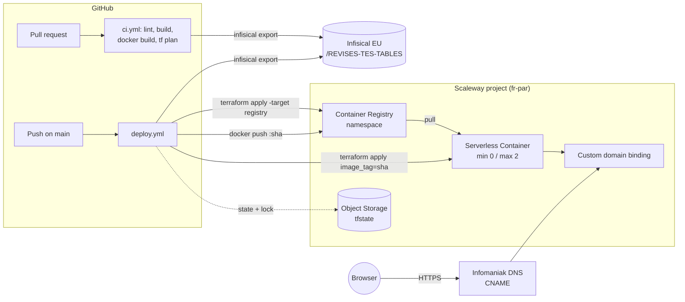

# Scaleway Serverless Container deployment — design

**Date:** 2026-10-04
**Status:** approved design, pending implementation plan
**Replaces:** Vercel hosting of `revises-tes-tables.gravitek.io`

## 1. Goal and success criteria

Move the hosting of the application from Vercel to a Scaleway Serverless Container
that scales to zero, while keeping the public domain `revises-tes-tables.gravitek.io`
(DNS zone managed at Infomaniak).

Success means:

- A push to `main` results in the new version being live on the custom domain with
  no manual step.
- Pull requests are validated (lint, build, Docker build, `terraform plan`) before merge.
- The infrastructure is fully described as Terraform code inside this repository.
- Idle cost is near zero (`min_scale = 0`).
- No administrator credential is ever stored in GitHub, and no Scaleway credential
  either: secrets live in Infisical and GitHub only holds the Infisical credential.

## 2. Decisions taken

| Topic | Decision |
|---|---|
| Scaleway project | Dedicated, already created: `7b8f19b7-3895-43d5-a9e5-0fefa17a0be9` |
| Region | `fr-par` |
| Terraform state | Scaleway Object Storage bucket (S3-compatible), native lockfile |
| DNS record | One-time manual CNAME at Infomaniak, value given by a Terraform output |
| Environments | Production only |
| Runtime | nginx serving the Next.js static export |
| Secrets source of truth | Infisical EU (`eu.infisical.com`), shared project "Gravitek.io", env `prod`, path `/REVISES-TES-TABLES` |
| CI access to Infisical | Dedicated machine identity (Universal Auth) for this application; secrets fetched with the Infisical CLI (`infisical export`), same pattern as gravitek-website |
| CI auth to Scaleway | IAM application API key stored in Infisical (Scaleway has no workload OIDC) |

Rejected alternatives:

- **`next start` with `standalone` output.** Requires a Node runtime, slower cold
  start, more memory, and a code change, for no benefit on a static site.
- **Terraform-managed CNAME via the Infomaniak provider.** Would require an
  Infomaniak token with write access on the whole `gravitek.io` zone in GitHub, for
  a record that never changes.
- **Terraform-managed IAM application / state bucket.** Chicken-and-egg: it would
  require admin credentials in CI. Kept as a documented bootstrap instead.
- **Terraform creating the Scaleway project.** Would require organization-level
  rights for the CI key.
- **Infisical → GitHub integration (secret sync).** cloud-compass moved to it in
  August 2026 and documented the trap: the sync does a full replace of the repo's
  secrets and pruned the Infisical credential itself. The CLI approach is safe as long
  as that integration is never enabled on this repository. This is recorded as a rule
  in the runbook.
- **Installing the Infisical CLI from the Cloudsmith apt repository.** Decommissioned
  on 2026-09-16 (gravitek-website still points at it and will break). The CLI is
  installed as a pinned release binary with checksum verification instead.

## 3. Architecture

### 3.1 Runtime image

Multi-stage `Dockerfile` at the repository root:

1. **Build stage** — `node:22-alpine`: `npm ci`, `npm run build`. Produces `out/`
   (Next.js `output: 'export'`, already configured).
2. **Serve stage** — `nginx:alpine-slim`, running as a non-root user, listening on
   port `8080`, serving `out/`.

nginx configuration (`docker/nginx.conf`, mounted into the image):

- `worker_processes 1` to keep memory predictable under Scaleway sandbox v2 (no
  copy-on-write for forked processes).
- Route resolution compatible with `trailingSlash: true`: `/config/` serves
  `/config/index.html`; a request without trailing slash is redirected (301) to the
  trailing-slash form so the behaviour matches Vercel.
- Unknown paths return `404.html` with status 404.
- `/_next/static/` served with `Cache-Control: public, max-age=31536000, immutable`.
  Other HTML pages served with `Cache-Control: no-cache` so deployments are picked
  up immediately.
- gzip enabled for text assets.
- Security headers: `X-Content-Type-Options: nosniff`, `X-Frame-Options: DENY`,
  `Referrer-Policy: strict-origin-when-cross-origin`,
  `Permissions-Policy: camera=(), microphone=(), geolocation=()`. No CSP in this
  change (Next.js inline scripts would need nonces); flagged as a possible follow-up.
- `/healthz` returns `200 ok` with no logging, used as the container liveness probe.
- Server tokens hidden.

A `.dockerignore` excludes `node_modules`, `.next`, `out`, `.git`, docs and infra.

### 3.2 Terraform (`infra/`)

Single root module. Files:

| File | Content |
|---|---|
| `versions.tf` | `required_version >= 1.10`, `scaleway` provider `~> 2.x`, S3 backend block (bucket, key, region, endpoint, `use_lockfile = true`, `skip_s3_checksum = true`, skip-AWS-validation flags). `.terraform.lock.hcl` is committed. |
| `providers.tf` | Scaleway provider configured from variables (`project_id`, `region`) |
| `variables.tf` | `project_id`, `region` (default `fr-par`), `app_name` (default `revises-tes-tables`), `hostname` (default `revises-tes-tables.gravitek.io`), `image_tag` |
| `registry.tf` | `scaleway_registry_namespace` (private) |
| `container.tf` | `scaleway_container_namespace`, `scaleway_container` |
| `domain.tf` | `scaleway_container_domain` |
| `outputs.tf` | `container_endpoint` (CNAME target), `public_url`, `registry_endpoint` |
| `README.md` | Runbook (see §5) |

`scaleway_container` settings:

- `image = "${registry endpoint}/web:${var.image_tag}"` — immutable tag
  equal to the git SHA; a tag change triggers a redeploy, rollback is a tag change.
- `port = 8080`, `protocol = "http1"`, `privacy = "public"`.
- `min_scale = 0`, `max_scale = 2`.
- `memory_limit_bytes = 128000000`, `cpu_limit = 70` (smallest allowed tier). Scaleway
  normalises memory in 10^6 units, so the decimal value avoids a perpetual plan diff
  (lesson from gravitek-website).
- `sandbox = "v2"` for faster cold starts.
- `https_connections_only = true`.
- `liveness_probe { http { path = "/healthz" } }` with a short interval.
- `timeout` left at default.

Backend credentials: the S3 backend reads `AWS_ACCESS_KEY_ID` / `AWS_SECRET_ACCESS_KEY`,
which CI sets from the same Scaleway API key. The bucket name
(`revises-tes-tables-tfstate`) and the project ID are not secrets and are committed
(backend block and variable default), which keeps the Infisical folder down to the two
Scaleway keys.

### 3.3 GitHub Actions

Two workflows under `.github/workflows/`.

**`ci.yml`** — trigger: `pull_request` targeting `main`.

1. `npm ci`, `npm run lint`, `npm run build`.
2. `docker build` (no push) then Trivy scan as a merge gate: `HIGH,CRITICAL`,
   `ignore-unfixed`, `exit-code 1` (same gate as the sibling repos).
3. `terraform fmt -check -recursive`, `terraform init -backend=false`,
   `terraform validate`. These need no credentials and always run.
4. `terraform plan -var image_tag=<sha>` with the real backend, appended to the job
   summary. Runs only when the Infisical credential is available (skipped for
   Dependabot and fork PRs, which have no access to repository secrets).

**`deploy.yml`** — trigger: `push` on `main`. Environment `production`.
Concurrency group `deploy-production`, `cancel-in-progress: false`.

1. `npm ci`, `npm run lint`, `npm run build` (fail fast before touching infra).
1b. Fetch secrets from Infisical (see "Secrets fetch step" below) and verify that
   every required variable is present.
2. `terraform init` + `terraform apply -auto-approve -target=scaleway_registry_namespace.main`
   so the registry exists before the first image push. Idempotent on later runs.
3. `docker login` to the registry endpoint (user `nologin`, password = secret key),
   `docker build`, push tags `<sha>` and `latest`.
4. `terraform apply -auto-approve -var image_tag=<sha>`.
5. Smoke test: `curl --fail` on the public URL `/healthz` and `/` (retry a few times
   to absorb the first cold start).

Common rules:

- Actions pinned to full commit SHAs with a version comment.
- `permissions: contents: read` at workflow level (plus `pull-requests: write` only if
  the plan is posted as a comment; default is job summary, so not needed).
- Node version read from `.nvmrc` (added, `22`).
- Dependabot extended with `github-actions` and `docker` ecosystems.

**Secrets fetch step** (shared by both workflows):

1. Install the Infisical CLI as a pinned release binary from GitHub releases, verified
   against its published checksum. Never `curl | sudo bash` from a mutable URL.
2. Obtain a short-lived token with the machine identity (Universal Auth) and run
   `infisical export --domain=https://eu.infisical.com --env=prod --path=/REVISES-TES-TABLES --format=dotenv`
   into a temporary file with `set -euo pipefail`, so a failed fetch fails the step
   instead of silently producing an empty environment (lesson from cloud-compass).
3. For each line: strip the single quotes added by the dotenv format, register the value
   with `::add-mask::` (values of 8 characters or more), append to `GITHUB_ENV`.
4. Verify the required keys are present and fail with an explicit message otherwise.

**Infisical folder `/REVISES-TES-TABLES` (env `prod`):**

| Key | Purpose |
|---|---|
| `SCW_ACCESS_KEY` | CI IAM application access key (Terraform provider, S3 backend, registry login) |
| `SCW_SECRET_KEY` | CI IAM application secret key |

The workflow derives `AWS_ACCESS_KEY_ID` / `AWS_SECRET_ACCESS_KEY` from these for the
state backend. Project ID, region, hostname and bucket name are committed constants.

**GitHub Actions secrets:** only the Infisical machine-identity credential, using
Universal Auth: `INFISICAL_CLIENT_ID` and `INFISICAL_CLIENT_SECRET`. The CLI exchanges
them for a short-lived access token on every run
(`infisical login --method=universal-auth --plain`). Token Auth was considered and
rejected: a long-lived token stays valid until rotated. No GitHub variables are needed.

**Rule:** the Infisical → GitHub integration must never be enabled on this repository
(it would prune the Infisical credential itself; see rejected alternatives).

### 3.4 Bootstrap (manual, once, by an administrator)

Documented in `infra/README.md`:

1. Project already exists.
2. Create the Object Storage bucket for state (private, versioning enabled) in
   `fr-par`.
3. Create an IAM application `github-actions-revises-tes-tables`, an IAM policy
   scoped to the project with permission sets `ContainersFullAccess`,
   `ContainerRegistryFullAccess`, `ObjectStorageFullAccess`, and an API key for that
   application (with the project as preferred project for Object Storage).
4. In Infisical (project "Gravitek.io", env `prod`), create the folder
   `/REVISES-TES-TABLES` and store `SCW_ACCESS_KEY` / `SCW_SECRET_KEY` there.
5. In Infisical, create a machine identity dedicated to this application
   (Universal Auth) with read access restricted to that folder, and register its client
   ID and client secret as the GitHub secrets `INFISICAL_CLIENT_ID` and
   `INFISICAL_CLIENT_SECRET`.
6. Push to `main` (or run the workflow manually) for the first deploy.
7. Read the `container_endpoint` output and replace the Vercel CNAME at Infomaniak.
8. Verify with `dig` and `curl`, then remove the Vercel project.

## 4. Error handling and operational concerns

- **Failed deploy:** Terraform waits for the container to be `ready`; a failing
  liveness probe aborts the rollout and the previous revision keeps serving. The
  workflow fails and nothing else changes.
- **Rollback:** re-run `deploy.yml` on a previous commit, or apply with a previous
  `image_tag` locally.
- **Concurrent applies:** prevented by the GitHub concurrency group and the S3
  lockfile.
- **Dependabot and fork PRs:** repository secrets are not exposed to them, so the
  `terraform plan` step is skipped when the Infisical credential is empty; lint, build,
  Docker build, Trivy, `fmt` and `validate` still run.
- **Secrets fetch failure:** the export runs under `set -euo pipefail` into a file and
  a verification step checks required keys, so a broken token fails the job with a
  clear message rather than a misleading `docker login` error later.
- **Cold start:** expected ~1 s for nginx under sandbox v2. Acceptable for a
  personal educational app; `min_scale` can be raised later if needed.
- **Image retention:** old tags accumulate in the registry; cleanup is a possible
  follow-up (not required for correctness).

## 5. Documentation updates

- `infra/README.md`: runbook (bootstrap, Infisical folder and machine identity, first
  deploy, DNS cutover, rollback, Vercel decommission, local Terraform usage, the
  "no Infisical → GitHub integration" rule).
- `README.md`: new "Déploiement" section pointing to the runbook, with the mermaid
  pipeline diagram.
- `CLAUDE.md`: deployment architecture summary and the rule that infra lives in
  `infra/` and is applied only by CI.

## 6. Testing strategy

- **Local:** `docker build` then run the container and `curl` `/`, `/config/`,
  `/config` (expect 301), an unknown path (expect 404 with `404.html`), `/healthz`
  (expect 200), and check `Cache-Control` on a `_next/static` asset.
- **CI on PR:** lint, build, Docker build, `terraform validate` and `plan`.
- **CI on main:** post-deploy smoke test on the public URL.

## 7. Prerequisite discovered during planning

`npm ci` fails on `main` (2026-10-04): Dependabot merged TypeScript 7, rejected by
typescript-eslint's peer range (`< 6.1.0`), and Tailwind 4 while the config and CSS use
the v3 syntax. The implementation plan starts by pinning TypeScript `^5.9.3` and
Tailwind `^3.4.17` (verified to resolve) and tells Dependabot to ignore major updates of
both until a deliberate migration. Without this, every CI job would fail at `npm ci`.

## 8. Out of scope / follow-ups

- Unit test layer for the application (required by project conventions, absent
  today). Suggested as the next change so CI can run `npm test`.
- Content-Security-Policy header.
- Registry image retention policy.
- Staging environment.

## 9. Amendments during implementation (2026-10-04)

- Terraform variables `enable_custom_domain`, `min_scale`, `max_scale` and output `container_url` were added; the image is named `web`.
- Secrets export uses `--format=json` parsed with jq; every value is masked (no 8-character threshold); variables are written with random heredoc delimiters; only the keys listed in `required-keys` are exported (allowlist), everything else in the folder is ignored.
- The `infisical-secrets` action has a `project-id` input defaulting to the shared "Gravitek.io" project `358e7cc0-a204-47d6-9be7-32579c92dc60`.
- First deploy is a two-run sequence (`bootstrap=true` dispatch, then the CNAME, then a normal run) because the CNAME cannot exist before the container endpoint is known. The push-triggered run on merge fails at the domain binding and is cancelled or ignored.
- Piped workflow steps use `shell: bash` because GitHub's default shell has no pipefail.
- An HSTS header (`max-age=63072000`, no `includeSubDomains`) was added to the nginx security headers.
- The trade-off that same-repository PRs receive the Scaleway CI key through the plan job is documented in `ci.yml` and the runbook.
