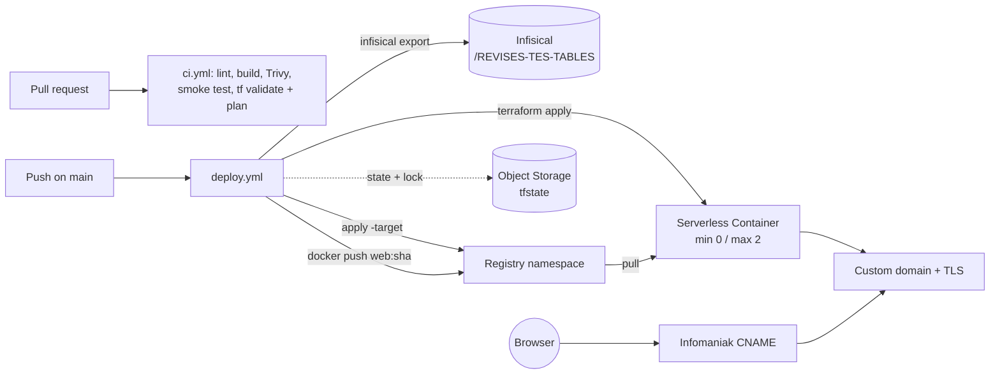

# Infrastructure (Terraform) and deployment runbook

Scaleway resources for `revises-tes-tables`, managed as code: Container Registry
namespace, Serverless Container (scale to zero), custom domain with managed TLS.
Remote state lives in a private Scaleway Object Storage bucket. Everything is
applied by GitHub Actions (`.github/workflows/deploy.yml`); humans run Terraform
locally only to inspect (`plan`) or to recover.

| Item | Value |
|---|---|
| Scaleway project | `7b8f19b7-3895-43d5-a9e5-0fefa17a0be9` |
| Region | `fr-par` |
| State bucket | `revises-tes-tables-tfstate` (private, versioning on) |
| Image | `rg.fr-par.scw.cloud/revises-tes-tables/web:<git-sha>` |
| Public hostname | `revises-tes-tables.gravitek.io` (CNAME at Infomaniak) |
| Secrets | Infisical EU, project "Gravitek.io" (`358e7cc0-a204-47d6-9be7-32579c92dc60`), env `prod`, path `/REVISES-TES-TABLES` |

## Pipeline



## One-time bootstrap (administrator, by hand)

These steps need administrator rights on the Scaleway organization and on
Infisical. They are done once; nothing here is stored in GitHub.

1. **State bucket** (the backend must exist before the first `terraform init`).
   The bucket is private with versioning enabled:

   ```bash
   # Run with a CLI profile whose API key belongs to the dedicated project
   # (its "preferred project" for Object Storage must be 7b8f19b7-3895-43d5-a9e5-0fefa17a0be9).
   scw object bucket create revises-tes-tables-tfstate region=fr-par acl=private enable-versioning=true
   ```

   The bucket lands in the project of the API key or profile in use. The Scaleway
   console (Object Storage → Create bucket, private, versioning on, in the
   dedicated project) is an equivalent alternative.

2. **CI identity on Scaleway**: in IAM, create the application
   `github-actions-revises-tes-tables`, attach a policy scoped to the project
   `7b8f19b7-3895-43d5-a9e5-0fefa17a0be9` with the permission sets
   `ContainersFullAccess`, `ContainerRegistryFullAccess`, `ObjectStorageFullAccess`,
   then generate an API key for the application with that project as the preferred
   project for Object Storage.

3. **Infisical folder**: in project "Gravitek.io", environment `prod`, create the
   folder `/REVISES-TES-TABLES` and add:

   | Key | Value |
   |---|---|
   | `SCW_ACCESS_KEY` | access key from step 2 |
   | `SCW_SECRET_KEY` | secret key from step 2 |

4. **Infisical machine identity**: create `github-actions-revises-tes-tables`
   with **Universal Auth**, give it read access to the `prod` environment
   restricted to `/REVISES-TES-TABLES` (and nothing else), create a client
   secret, and register in GitHub (Settings → Secrets and variables → Actions):

   | GitHub secret | Value |
   |---|---|
   | `INFISICAL_CLIENT_ID` | machine identity client ID |
   | `INFISICAL_CLIENT_SECRET` | machine identity client secret |

   The composite action `.github/actions/infisical-secrets` targets the shared
   "Gravitek.io" project (`358e7cc0-a204-47d6-9be7-32579c92dc60`) by default,
   through its `project-id` input. The machine identity must therefore be created
   in that project, otherwise the login or the export fails.

   Never enable the Infisical → GitHub integration (secret sync) on this
   repository: it performs a full replace of the repository secrets and would
   delete these two.

5. **GitHub environment**: create the environment `production` (no extra
   secrets needed; it exists for deployment history and optional protection rules).
   Restrict its deployment-branch policy to `main` (Settings → Environments →
   `production` → Deployment branches and tags → Selected branches). Otherwise
   `workflow_dispatch` can be run from any branch and would deploy that branch's
   workflow definition to production.

## First deploy and DNS cutover

1. Merge the deployment PR. The merge pushes to `main`, which immediately runs
   `deploy.yml` on its normal path (`enable_custom_domain=true`). That run creates
   the registry, the namespace and the container, then fails at the custom domain
   binding because the CNAME still points at Vercel; the provider retries DNS
   resolution for up to 10 minutes before giving up. Cancel this automatic run from
   the Actions tab as soon as it starts, or let it fail (harmless: the failed
   binding is not kept). Then run the first deploy without the custom domain (the
   CNAME cannot exist before the container endpoint is known):

   ```bash
   gh workflow run deploy.yml --repo Gravitek-io/revises-tes-tables -f bootstrap=true
   ```

   Do not dispatch `bootstrap=true` once the domain is bound: it destroys the
   binding until the next normal run.

2. When the run is green, read the CNAME target from the run summary ("CNAME target
   (Infomaniak)") or, with the credentials exported as in the section "Running
   Terraform locally" below, with:

   ```bash
   cd infra && terraform init && terraform output -raw container_endpoint
   ```

   Open `https://<container_endpoint>/` and check the site.

3. At Infomaniak, in the `gravitek.io` zone, replace the Vercel record for
   `revises-tes-tables` with:

   ```
   revises-tes-tables  CNAME  <container_endpoint>.
   ```

   Check propagation: `dig +short revises-tes-tables.gravitek.io CNAME`.

4. Run a normal deploy to bind the domain (Scaleway issues the certificate):

   ```bash
   gh workflow run deploy.yml --repo Gravitek-io/revises-tes-tables
   ```

   Scaleway issues the TLS certificate after the binding, which can take a few
   minutes. If the deploy's custom-domain smoke test fails on this first bind
   while the native URL passes, wait a few minutes and re-run the workflow.

5. Verify: `scripts/smoke-test.sh https://revises-tes-tables.gravitek.io`.

6. **Post-deploy check (mandatory once):** with the same credentials exported
   locally (see below), run `terraform plan -var image_tag=<deployed sha>` and
   confirm `No changes.` A perpetual diff (memory units, probe defaults) would
   redeploy the container on every apply.

7. Decommission Vercel: delete the project in the Vercel dashboard and remove any
   leftover Vercel DNS record.

## Rollback

Redeploy a previous image tag (any git SHA already pushed to the registry):

```bash
gh workflow run deploy.yml --repo Gravitek-io/revises-tes-tables -f image_tag=<previous-sha>
```

The tag must already exist in the registry: a missing tag fails at
`terraform apply`. On a rollback, lint, build and push are skipped; the secrets
fetch, `terraform apply` and the smoke tests still run.

## Running Terraform locally (inspection or recovery)

```bash
export SCW_ACCESS_KEY="<ci or admin access key>"
export SCW_SECRET_KEY="<matching secret key>"
export AWS_ACCESS_KEY_ID="$SCW_ACCESS_KEY"
export AWS_SECRET_ACCESS_KEY="$SCW_SECRET_KEY"
cd infra
terraform init
terraform plan -var image_tag=<sha currently deployed>
```

Never run `terraform apply` locally while a deploy workflow is running: the
S3 lockfile protects the state, but the pipeline owns the image tag.

## Troubleshooting

- **`docker login` fails with "Password required"**: the Infisical fetch did not
  produce `SCW_SECRET_KEY`. Read the "Fetch secrets from Infisical" step first; it
  names the missing key or the failed login.
- **`scaleway_container_domain` fails to create**: the CNAME does not resolve yet.
  Re-run the deploy with `bootstrap=true` (this removes an existing binding), fix
  DNS, then run normally.
- **Container stuck in `error`**: logs are in the Scaleway console → Serverless →
  Containers → the container → Logs (Cockpit). The current status can be read with
  `scw container container get <id> region=fr-par`.
- **State lock left behind after a cancelled run**: `terraform force-unlock <id>`
  from a local checkout with the credentials above.

## Security notes

- **Pull requests and the Scaleway CI key**: same-repository pull requests receive
  the Infisical credential, and therefore the Scaleway CI key, through the plan
  job of `ci.yml`. Fork and Dependabot pull requests do not. Only accounts with
  write access can push same-repository branches, so this is accepted. If external
  contributors are ever granted write access, create a read-only Scaleway key for
  plans in a separate Infisical folder, with its own machine identity.
- **Pinned Infisical CLI**: its version and SHA256 are pinned in
  `.github/actions/infisical-secrets/action.yml` and are not managed by
  Dependabot. Bump them by hand from
  <https://github.com/Infisical/cli/releases>: download `checksums.txt` and copy
  the hash of `cli_<version>_linux_amd64.tar.gz`.
- **Log masking**: every value in the Infisical folder is masked in logs
  regardless of its length, so the folder must stay secrets-only (no short or
  non-sensitive values such as regions or booleans).
